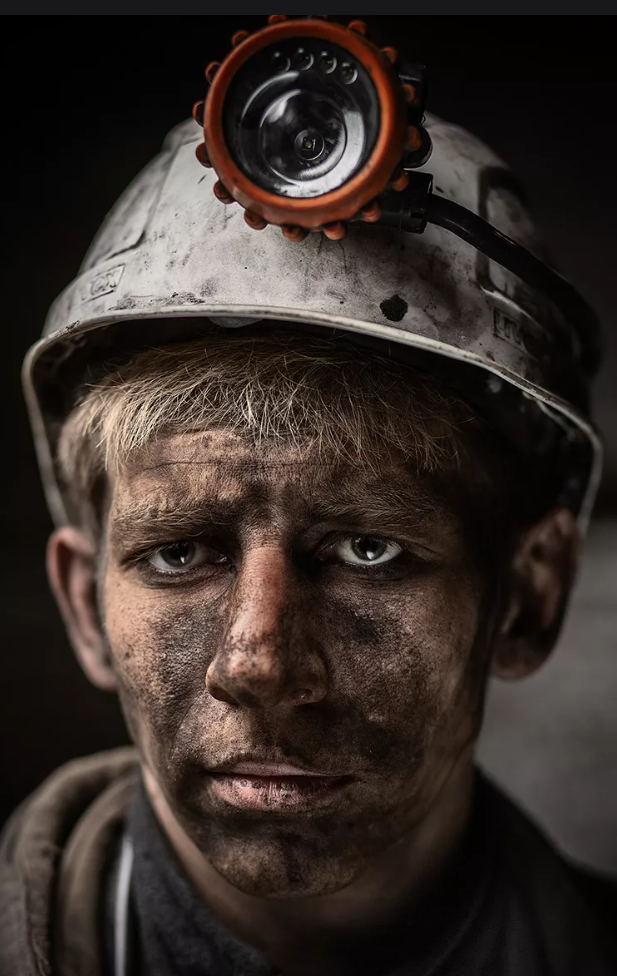

  
  

    

                            Иванов Иван Иванович  
                            Возраст: 35 лет  
                            Профессия: Шахтер

  

**Опыт работы:**

     Шахтер (мастер кирки) — 20 лет
     Место работы: Глубокинская шахта
     Обязанности: Выполнение горных работ, добыча полезных ископаемых, 
     обеспечение безопасности на участке, поддержание оборудования в 
     рабочем состоянии.

**Навыки:**

    Высокая физическая выносливость и сила.
    Опыт работы с ручным инструментом (кирка, лопата).
    Знание технологий безопасной добычи и правил охраны труда.
    Умение работать в сложных условиях и в команде.

**Личные качества:**

    Ответственность и внимательность.
    Способность принимать решения в экстренных ситуациях.
    Дисциплинированность и надежность.

**Образование:**

    Среднее специальное, Горный техникум, специальность "Шахтное дело".

**Дополнительно:**

    Наличие всех необходимых сертификатов и аттестаций.
    Готовность к работе в сменном графике.